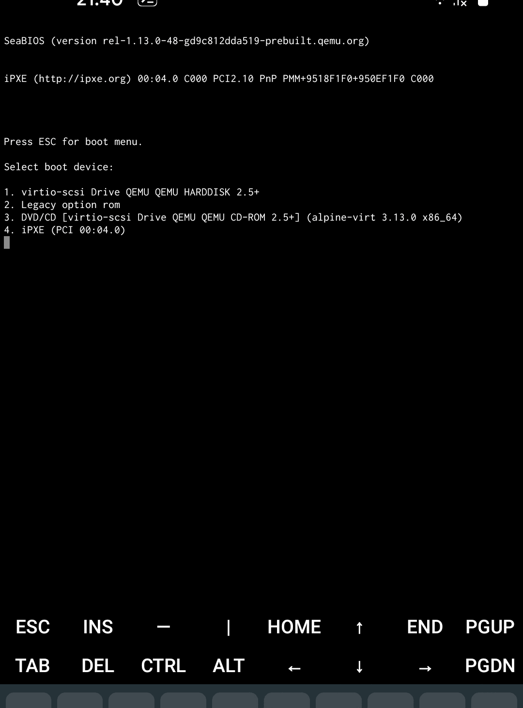
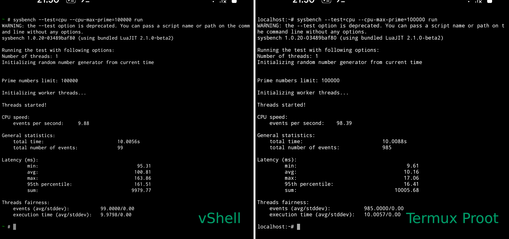

# vShell

> Actually, that's a relaunch of Alpine Term project. Even though setup is
> different, the whole idea to bring terminal app powered by virtual machine
> is just in its early versions (v0.x - v3.x).

> vShell is an example of how Android terminal apps can look like after
> Google enforces its execve() lockdown: https://github.com/termux/termux-app/issues/1072

vShell is a virtual shell environment application for the Android OS. It
provides a virtual machine running small Linux distribution ready for the
use out-of-box.

Here are some details on the virtual machine configuration:

- CPU: emulated 1-core x86 64-bit.
- RAM (1\*): 32% of host memory + 8% for QEMU TCG buffers.
- HDD: 64 GB, has a default 4 GB partition for user data.
- Host storage: via 9P file system, mount tag `host_storage`.
- Network: user-mode via SLiRP.
- Operating system (2\*): [Alpine Linux](https://alpinelinux.org/) in diskless mode (3\*)

1. *RAM allocations beyond 40% - 50% are not safe due to increased probability
   that Android will kill application to reclaim memory.*
2. *vShell does not provide a way to boot custom disk images. That's beyond the
   application's purpose and custom OS is not guaranteed to work.*
3. *Diskless mode: vShell provides a diskless installation by default where OS is
copied (about 40 MB) from CD-ROM into RAM but user data is still stored on disk.
Application supports on-disk installation as well, but you will need to re-install
OS. See https://wiki.alpinelinux.org/wiki/Installation for more information.*

**Warning**: this application has features which you may not like (lol):
- Requires a high-end device.
- Runtime environment is isolated from host OS and hardware.
- Requires skills in shell scripting and Linux system administering.
- One terminal session. Use a multiplexer (`tmux`) for more.
- No graphics.
- No Kali Linux and Parrot OS support.

**Disclaimer**: neither vShell application nor its author is affiliated with
the [Alpine Linux](https://alpinelinux.org/) project. Operating system is provided
as-is and vShell author is not responsible about bugs in the software packages.

<p align="center"></p>

## Performance

> QEMU emulation adds a noticeable overhead. But it is not big enough to make
> running system unusable. It is fast enough to let perform some general tasks.

See below a performance comparison between vShell ([QEMU](https://qemu.org))
and host ([Termux Proot](https://wiki.termux.com/wiki/PRoot)) made via
[Sysbench](https://github.com/akopytov/sysbench) benchmarking tool.

<p align="center"></p>

According to benchmark vShell seems to be about 10 times slower than Alpine
Linux installation inside proot'ed environment in [Termux](https://termux.com).
However be noted that in some (worst) cases it actually can be up to 25 times
slower than host.

Do not forget that at cost of performance you are getting a full virtual
machine providing a root access to a separate operating system.

## Development cheat-sheet
### Project structure

Some parts were borrowed from [Termux](https://github.com/termux) project.
Though many things were either modified a lot or removed as application is
mainly a frontend for QEMU serial console.

- Top directory: Android application project root.
- `./app`: the main application sources (Java).
- `./native-packages`: a build environment for compiling native binaries.
  Needs a Docker installation for use.
- `./native-packages/jniLibs`: a prebuilt [QEMU](https://qemu.org) Android JNI
  library for each architecture. This directory is symlinked in app module.
  *Built separately*.
- `./user-guide`: a user's guide written in Markdown. Corresponding HTML file
  is placed to assets directory of application. *Built separately*.

### Compiling the app

1. Ensure that Java 8 on a host with Linux distribution (Ubuntu preferably)
   installed. Building application on Windows is not tested.
2. Set environment variable `ANDROID_HOME` pointing to valid up-to-date Android
   SDK installation.
3. If you are not project author, disable import of release configuration as
   it is encrypted and not usable by `gradle`:
   ```
   sed -i "/apply from: 'release.gradle'/d" app/build.gradle
   sed -i "/signingConfig signingConfigs.release/d" app/build.gradle
   ```
4. Compile the app:
   ```
   ./gradlew assembleDebug
   ```
5. Get the APK file from `./app/build/outputs/apk/debug`.

If you are interested in instructions of building the native code part ([QEMU](https://qemu.org))
from source, then refer to README in [./native-packages](./native-packages/README.md).

## Resources

- [Termux](https://github.com/termux): Android terminal emulator with package ecosystem.
- [Android Terminal Emulator](https://github.com/jackpal/Android-Terminal-Emulator):
  The first terminal app for Android OS. Deprecated.
- [QEMU](https://qemu.org): A generic machine emulator and virtualizer.
- [Alpine Linux](https://alpinelinux.org/): A lightweight Linux distribution built
  on Musl libc and Busybox.
